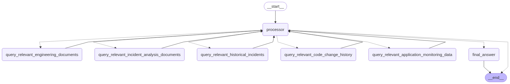
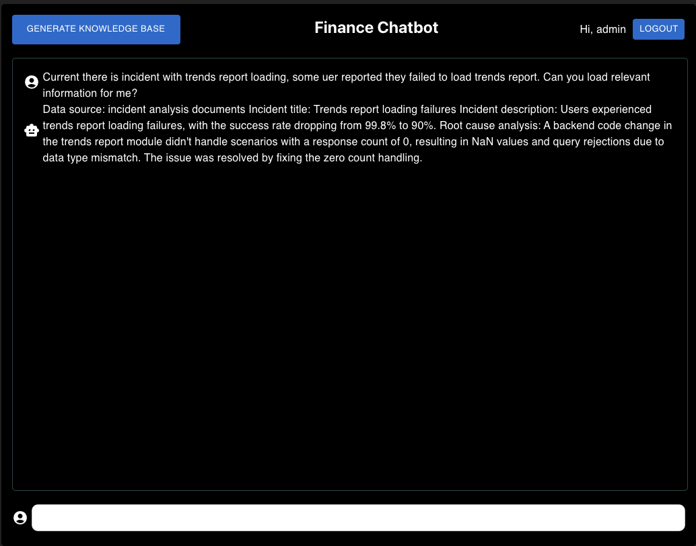

# AI SRE Guide

**Table of Contents**

- [AI SRE Guide](#ai-sre-guide)
  - [Overview and major functions](#overview-and-major-functions)
    - [Backend functions](#backend-functions)
      - [Adaptive RAG solution graph](#adaptive-rag-solution-graph)
    - [Frontend functions](#frontend-functions)
  - [Backend setup](#backend-setup)
  - [Frontend setup](#frontend-setup)
  - [Used dataset](#used-dataset)

## Overview and major functions
The AI SRE is powered by generative AI and RAG (Retrieved Augment Generation).
- AI SRE can be based on user query, search around and retrieve accurate information from different data sources (for demo just integrate PDF files, but can easily support more) which are set up early with provided dataset or directly pull from network (like Elastic search, Github info etc), then use those contexts with LLM to formulate a final answer to user.
- LLM I use Google `Gemini-2.0-flash` which is high efficiency and fast multi-modal large language model, data embedding use Google `text-embedding-004`.
- Backend web framework I use `FastAPI` which is a very popular and high performance Python web framework built on AsyncIO and OpenAPI.
- Frontend built a simple UI with React, to let user ingest all the raw data (indexing and put them in SQL DB or vector DB) and interact with chatbot.
- Generative AI framework use Langchain, which is very popular and powerful framework which can efficiently develop generative AI features.
- RAG / agentic flow part we also use LangGragh which is very powerful tool to support complicated agentic work flow and adaptive RAG.
- Use Postgres as SQL DB and Weaviate DB as vector data in app to save different kinds of data, I use docker build environment with these tools for app.
- App includes simple user management and authentication,
- Simple frontend UI to let user ingest all the raw data (indexing and put them in SQL DB or vector DB) and interact with chatbot

### Backend functions
Backend all APIs are built with Python and `FastAPI`, I also heavily use `Langchain` and `LangGraph` tools in chatbot related modules. I include docker-compose file to easily build and launch the backend locally with docker.

Following are major functions in backend:
- Simple auth based on OAuth2.0 and JWT
- Simple user management, including add, get users etc. Chat management do need user information, this is the reason for including user management.
- Different types of document ingestion, including
    - PDF file loader based on PyMuPdf, load PDF file, chunk, indexing and save into vector database (Weaviate DB)
    - For incident analysis pdf file, use Multi-vector retrieval to based on pdf summary retrieve original PDF document, then use LLM to summarize key infomation like incident tile, incident description and root cause analysis and then return this to user
- [Adaptive RAG graph](#adaptive-rag-solution-graph) with 6 agent / tool nodes, this is core part of this chatbot solution. It can dynamically route query to different agents to collect enough context from all data source (DB table, vector collections, images and LLM), and then get best answer with these context and LLM.
- For RAG retrieval, for input question I use query translation technique (get 3 relevant queries and retrieve top 5 of all similar contents) to improve answer accuracy
- Most services, especially database operation and web communication parts, use fully async way for better performance.
- Use file hash to record all ingested documents in DB, this can avoid duplicated work in file ingestion.
- Use docker to set up and management backend services, including API service, easy for testing and deployment.
- use small dimensions (768) for text indexing to improve embedding efficiency, also keep good MTEB score

#### Adaptive RAG solution graph


### Frontend functions
Simple UI build based on React and Material UI, to let user ingest all the raw data (indexing and put them in SQL DB or vector DB) and interact with chatbot.

Following are major functions in Frontend:
- Auth support, all users need login to use app. Also button user can log out
- User can click `GENERATE KNOWLEDGE BASE` button to ingest all the documents given in app requirements. Ingestion may take few minutes, once done will show alert
- UI for user to chat with chatbot, also show all chat history for same user

## Backend setup
As backend use docker to set up, need docker installed before running it.

1. After you clone repository to local. Go to backend folder to set up .env file with contents in env.example file. You need Google AI Studio api key for this app.

2. To start backend, just run following command in app root folder (/ai-sre-demo):
```
yarn backend
```
1. Then it will load all services in docker and start backend api service. Once started, you use following url in browser to view all API
```
http://localhost:3100/docs
```

## Frontend setup
After you clone repository to local.

1. Go to frontend folder to set up .env file with contents in env.example file. Just one line to set up backend api url config.

2. To start frontend, just run following command in app root folder (/ai-sre-demo):
```
yarn frontend
```

3. Once it is done, you can use following url in browser to view all API
```
http://localhost:4000
```
As we already auto create an admin user in backend for testing, so you can use following username and password to login
- username: admin
- password: 54321

4. You need first setup knowledge base to finish ingestion of all data files. For this just click `GENERATE KNOWLEDGE BASE` button in top left corner. Normally it will take 1 minutes to finish everything, then you can test it with some query.

## Used dataset
- Backend `/data` folder has few documents will be used as incident analysis documents for later demo or simple testing, following is my test query and result I got in my test.
  - Current there is incident with trends report loading, some uer reported they failed to load trends report. Can you load relevant information for me?



